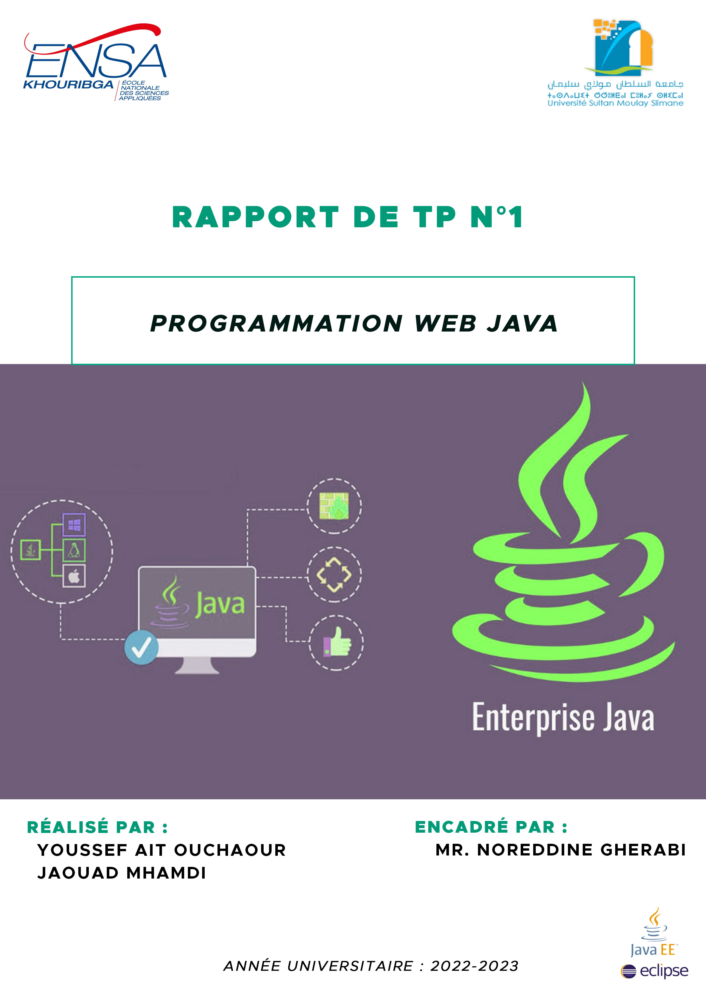
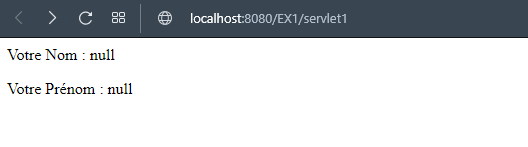
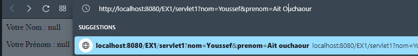
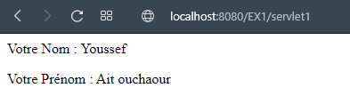
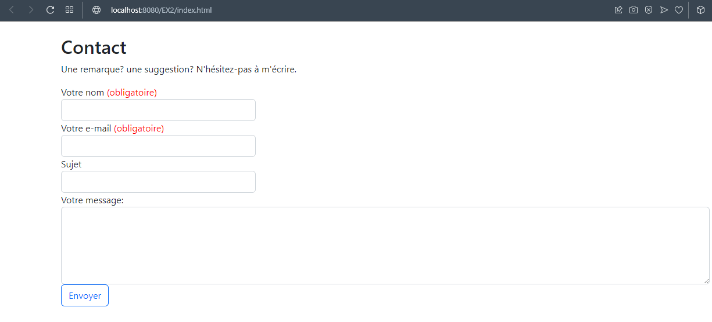
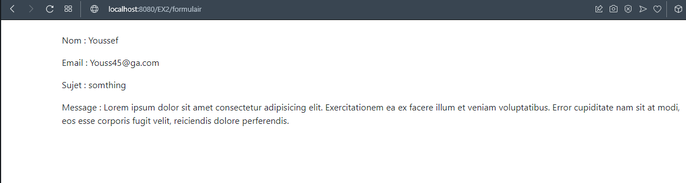
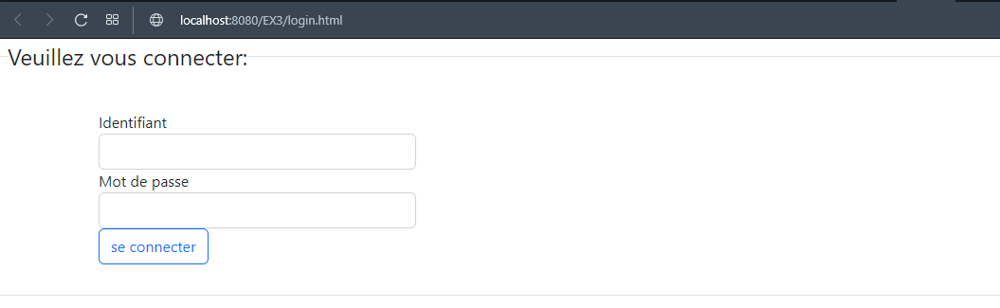
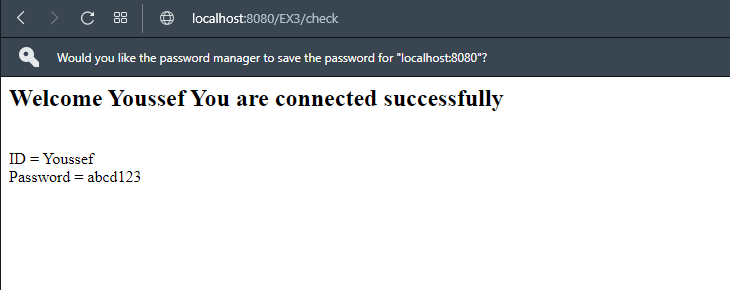

___

<h2 align="center" style="color:red">Sommaire </h2>

#### [Introduction](#cc1)  .........................................................................

#### [Solutions](#cc2)  ....................................................................

###### Exercice1
###### Exercice2
###### Exercice3

#### [Conclusion](#cc3) ...........................................................................

___


<h2 align="center" style="color:red" id="cc1">I. Introduction</h2>

**JEE ou Java Entreprise Edition est la version entreprise de la plate-forme Java qui se compose de nombreuses API(JSP, JDBC, Servlet...) et composants destinés à une utilisation côté serveur au sein du système d'information de l'entreprise. et dans ce TP nous allons découvrir des choses sur la technologie JEE, en particulier comment travailler avec les SERVLET et manipuler des pages Web (recevoir des requêtes et afficher des pages Web sur un navigateur) utilisant le code JAVA et HTML.**

___ 

<h2 align="center" style="color:red" id="cc2">II. Résolution de TP</h2>

### <span style="color:green"> Exercice1:</span>

  Dans cet exercice nous allons créer une servlet (**servlet1.java**) qui affiche le nom et le prénom  dans un page ,et qui sont fournis dans l'URL.
  Servlet est une classe Java qui permet de créer dynamiquement des données au sein d'un serveur HTTP et qui hérite de HttpServlet des methodes; et parmi ces méthodes **doGet**, avec lequel nous allons travailler dans cet exercice.

* ##### Resultats  :






* ##### Code  :


> <span style="color:teal;font-weight:bold">servlet1.java
```java
     package com.EX1;

import java.io.IOException;
import java.io.PrintWriter;

import javax.servlet.ServletException;
import javax.servlet.annotation.WebServlet;
import javax.servlet.http.HttpServlet;
import javax.servlet.http.HttpServletRequest;
import javax.servlet.http.HttpServletResponse;

/**
 * Servlet implementation class servlet1
 */

@WebServlet("/servlet1")

public class servlet1 extends HttpServlet {
	private static final long serialVersionUID = 1L;
       
    /**
     * @see HttpServlet#HttpServlet()
     */
    public servlet1() {
        super();
        // TODO Auto-generated constructor stub
    }

	/**
	 * @see HttpServlet#doGet(HttpServletRequest request, HttpServletResponse response)
	 */
	protected void doGet(HttpServletRequest request, HttpServletResponse response) throws ServletException, IOException {
		// TODO Auto-generated method stub
		response.setContentType("text/html");
		String nom = request.getParameter("nom");	//pour obtenir le nom de l'URL
		String prenom = request.getParameter("prenom"); //pour obtenir le Prénom de l'URL
		PrintWriter out = response.getWriter();
		out.print("<p>"+"Votre Nom : "+nom+"<br><p>");
		out.print("<p>"+"Votre Prénom : "+prenom+"<p>");
		
	}
}

  ```
___


### <span style="color:green"> Exercice2:</span>

  On va créer dans ce exercise un projet web dynamique qui contient un formulaire en format HTML(**index.html**), et une servlet(**Formulaire.java**) qui va récupérer les données du formulaire et les afficher dans une nouvelle page.
  et nous ne pouvons de faire ça qu'avec la methode **doPost** qui récupère les données du formulaire à l'aide de la variable *request* et la methode *getParameter*; et les affiche en utilisant la variable *out* et la methode *Println*.

* ##### Resultats  :
  





* ##### Code  :


> <span style="color:teal;font-weight:bold">Formulaire.java
```java
package com.EX2;

import java.io.IOException;
import java.io.PrintWriter;

import javax.servlet.ServletException;
import javax.servlet.annotation.WebServlet;
import javax.servlet.http.HttpServlet;
import javax.servlet.http.HttpServletRequest;
import javax.servlet.http.HttpServletResponse;

/**
 * Servlet implementation class formulaire
 */
@WebServlet("/formulaire")
public class formulaire extends HttpServlet {
	private static final long serialVersionUID = 1L;
	
    public formulaire() {
        super();
        // TODO Auto-generated constructor stub
    }
    
	protected void doPost(HttpServletRequest request, HttpServletResponse response) throws ServletException, IOException {
		response.setContentType("text/html");
		PrintWriter out = response.getWriter();
		
		String name = request.getParameter("nom");
		String email = request.getParameter("email");
		String subject = request.getParameter("sujet");
		String msg = request.getParameter("msg");
		out.println("<!DOCTYPE html>\r\n"   //pour afficher les données saisies.
				+ "<html>\r\n"
				+ "<head>\r\n"
				+ "<meta charset=\"UTF-8\">\r\n"
				+ "<title>Resultat</title>\r\n"
				+"<link rel=\"stylesheet\" href=\"https://cdn.jsdelivr.net/npm/bootstrap@4.0.0/dist/css/bootstrap.min.css\" />"
				+"<script src=\"https://cdn.jsdelivr.net/npm/bootstrap@5.2.2/dist/js/bootstrap.bundle.min.js\" integrity=\"sha384-OERcA2EqjJCMA+/3y+gxIOqMEjwtxJY7qPCqsdltbNJuaOe923+mo//f6V8Qbsw3\" crossorigin=\"anonymous\" defer></script>"
				+ "</head>\r\n"
				+ "<body>\r\n"
				+"<div class=\"container my-4\">"
				+"<p>"+"Nom : "+name+"<br></p>"
				+"<p>"+"Email : "+email+ "<br></p>"
				+"<p>"+"Sujet : "+subject+"<br></p>"
				+"<p>"+"Message : "+msg+"<br></p>"
				+"</div>"
				+ "</body>\r\n"
				+ "</html>");
	}
}

  ```

> <span style="color:teal;font-weight:bold">Index.html

```HTML
<!DOCTYPE html>
<html>
<head>
<meta charset="UTF-8">
<title>Index</title>
<!-- CSS only -->
<link href="https://cdn.jsdelivr.net/npm/bootstrap@5.2.2/dist/css/bootstrap.min.css" rel="stylesheet" integrity="sha384-Zenh87qX5JnK2Jl0vWa8Ck2rdkQ2Bzep5IDxbcnCeuOxjzrPF/et3URy9Bv1WTRi" crossorigin="anonymous">
<!-- JavaScript Bundle with Popper -->
<script src="https://cdn.jsdelivr.net/npm/bootstrap@5.2.2/dist/js/bootstrap.bundle.min.js" integrity="sha384-OERcA2EqjJCMA+/3y+gxIOqMEjwtxJY7qPCqsdltbNJuaOe923+mo//f6V8Qbsw3" crossorigin="anonymous" defer></script>

</head>
<body>
<div class="container my-4">
<h2 class="title">Contact</h2>
<p>Une remarque? une suggestion? N'hésitez-pas à m'écrire.</p>

<form action="formulaire" method="post" class="form">
<label for="nom">Votre nom <span style="color:red">(obligatoire)</span></label>
<input type="text" class="form-control" style="width:30%;" name="nom" required/>
<label for="email">Votre e-mail <span style="color:red">(obligatoire)</span></label>
<input type="email" class="form-control" style="width:30%;" name="email" required/>
<label for="sujet">Sujet</label>
<input type="text" class="form-control" style="width:30%;" name="sujet"/>
<label for="msg">Votre message:</label>
<textarea class="form-control" name="msg" cols="6" rows="5"></textarea>
<input type="submit" class="btn btn-outline-primary" value="Envoyer"/>
</form>
</div>
</body>
</html>
  ```
___

### <span style="color:green"> Exercice3:</span>

Dans cet exercice nous allons créer une page HTML (**login.html**) qui affiche le formulaire (ci-dessous) ; et une servlet(**Check.java**) qui vérifie si les informations saisies par l'utilisateur sont correctes, sinon on affiche une message d'erreur.

* ##### Resultats  :





* ##### Code  :


> <span style="color:teal;font-weight:bold">Check.java
```java
package com.EX3;

import java.io.IOException;
import java.io.PrintWriter;

import javax.servlet.ServletException;
import javax.servlet.annotation.WebServlet;
import javax.servlet.http.HttpServlet;
import javax.servlet.http.HttpServletRequest;
import javax.servlet.http.HttpServletResponse;

/**
 * Servlet implementation class check
 */
@WebServlet("/check")
public class check extends HttpServlet {
	private static final long serialVersionUID = 1L;
       
   
    public check() {
        super();
        // TODO Auto-generated constructor stub
    }
    
	protected void doPost(HttpServletRequest request, HttpServletResponse response) throws ServletException, IOException {
		response.setContentType("text/html");
		PrintWriter out = response.getWriter();
		
		String id = request.getParameter("id");
		String password = request.getParameter("pass");
		
		if(id.equals("Youssef") && password.equals("abcd123")) {
			
		out.print("<h2>"+"Welcome "+ id 
				+" You are connected successfully"
				+"</h2>"+"<br>"
				+"ID = "+id
				+"<br>"
				+"Password = "+password);
		}else {
			this.getServletContext().getRequestDispatcher("/login.html").forward(request, response);
		}
		
	}
}

  ```

> <span style="color:teal;font-weight:bold">login.html

```HTML
<!DOCTYPE html>
<html>
<head>
<meta charset="UTF-8">
<title>Login</title>
<!-- CSS only -->
<link href="https://cdn.jsdelivr.net/npm/bootstrap@5.2.2/dist/css/bootstrap.min.css" rel="stylesheet" integrity="sha384-Zenh87qX5JnK2Jl0vWa8Ck2rdkQ2Bzep5IDxbcnCeuOxjzrPF/et3URy9Bv1WTRi" crossorigin="anonymous">
<!-- JavaScript Bundle with Popper -->
<script src="https://cdn.jsdelivr.net/npm/bootstrap@5.2.2/dist/js/bootstrap.bundle.min.js" integrity="sha384-OERcA2EqjJCMA+/3y+gxIOqMEjwtxJY7qPCqsdltbNJuaOe923+mo//f6V8Qbsw3" crossorigin="anonymous" defer></script>

</head>
<body>
	<fieldset class="border p-2">
	<legend class="float-none w-auto">Veuillez vous connecter:</legend>
<div class="container my-4">
	<form action="check" method="post" >
	
        <label for="id">Identifiant</label>
        <input type="text" name="id" class="form-control" style="width:30%;">
        <label for="pass">Mot de passe</label>
        <input type="password" name="pass"  class="form-control" style="width:30%;">
        <input type="submit" value="se connecter" class="btn btn-outline-primary">
    </form>
</div>
	</fieldset>
</body>
</html>
  ```
___ 

<h2 align="center" style="color:red" id="cc3">III. Conclusion</h2>
on peut résumer ce qu'on a appris dans ce TP par les points suivant:

* se familiariser avec la notion de servlet.
* travailler avec les méthodes doGet et doPost et aussi connaitre ses différentes utilisations.
* créer des formulaires en utilisant HTML & bootstrap; et récupérer ses informations.

Et il y a aussi quelques autre notions sur JEE à découvrir dans les prochains TPs.
