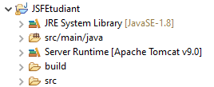
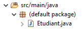
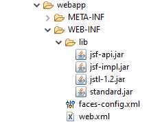
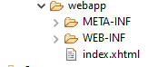
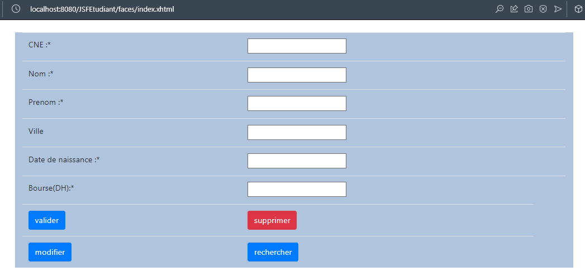
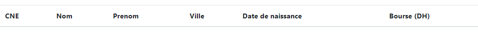
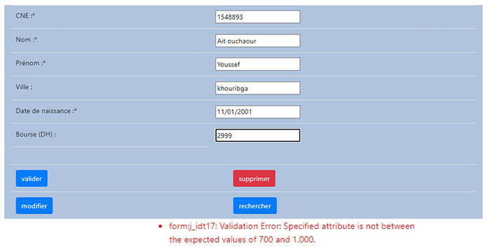
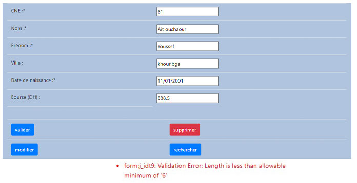
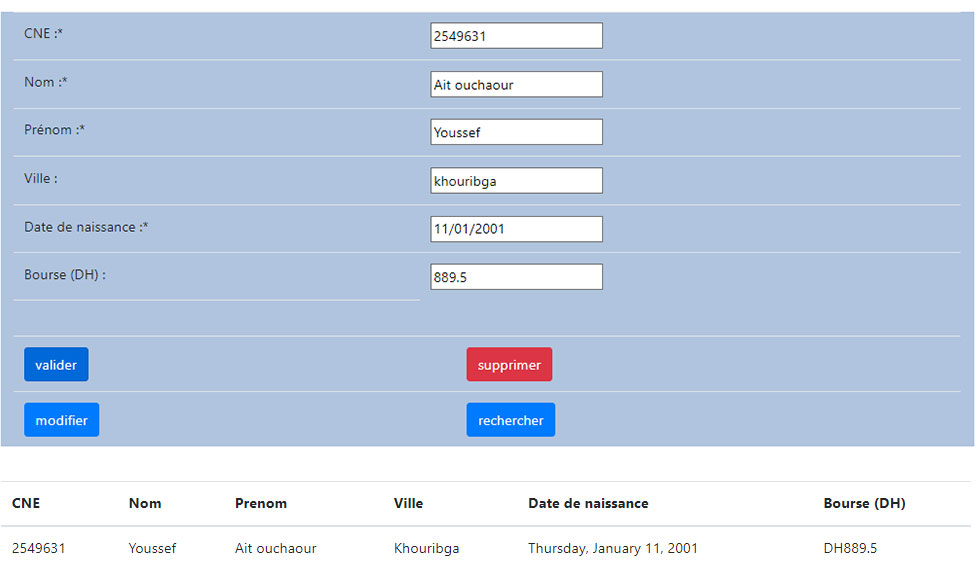

___

<h2 align="center" style="color:red">Sommaire </h2>
<span align="center">

#### ........................................... [Introduction](#cc1)  ...........................................

#### ........................................... [Solutions](#cc2)  .............................................
###### Partie I
###### Partie II

#### ........................................... [Conclusion](#cc3) ............................................

</span>

___


<h2 align="center" style="color:red" id="cc1">I. Introduction</h2>

**Dans une application web java on utilise la technologie JSP pour interpréter les règles métiers, mais afin de remplacer les scriptlets, utiliser plus de code java dans la partie front-end(JSP), et une bonne pratique de l'architecture MVC dans un application web nous utilisons JSTL (Jakarta Standard Tag Library), est un composant de JEE, et il s'agit d'une bibliothèque de balises pour les tâches courantes, comme le travail sur des fichiers XML, l'exécution conditionnelle, et les boucles.**

___ 

<h2 align="center" style="color:red" id="cc2">II. Solution de TP</h2>
 

<h4 style="color:green"><u>I-Création d'un projet JSF:</u></h4>

<h5 style="color:teal"> Q1 :</h5>

*  Créons un nouveau projet Web  *<< JSFEtudiant >>*
  
<h5 style="color:teal"> Q2 :</h5>

*  Créons un nouveau class  *<< Etudiant >>*
  

* le code source de class.
>**Etudiant.java**
```java
import java.util.Date;

public class Etudiant {
	
	private int cne;
	private String nom;
	private String prenom;
	private String ville;
	private Date dateN;
	private double bourse;
	
	public Etudiant() { super(); }
     
	public Etudiant(int cne, String nom, String prenom, String ville, Date dateN, double bourse) {
		super();
		this.cne = cne;
		this.nom = nom;
		this.prenom = prenom;
		this.ville = ville;
		this.dateN = dateN;
		this.bourse = bourse;
	}
	public int getCne() {
		return cne;
	}
	public void setCne(int cne) {
		this.cne = cne;
	}
	public String getNom() {
		return nom;
	}
	public void setNom(String nom) {
		this.nom = nom;
	}
	public String getPrenom() {
		return prenom;
	}
	public void setPrenom(String prenom) {
		this.prenom = prenom;
	}
	public String getVille() {
		return ville;
	}
	public void setVille(String ville) {
		this.ville = ville;
	}
	public Date getDateN() {
		return dateN;
	}
	public void setDateN(Date dateN) {
		this.dateN = dateN;
	}
	public double getBourse() {
		return bourse;
	}
	public void setBourse(double bourse) {
		this.bourse = bourse;
	}
}
```

<h5 style="color:teal"> Q3 :</h5>
   
* On ajout les librairies de JSF dans*<< WebContenent/WEB-INF/lib >>* .  
  
<h5 style="color:teal"> Q4 :</h5>
   
* Créons une fichier *<< index.xhtml >>* contient les tags HTML et Core de JSF.  
  

<h5 style="color:teal"> Q5 :</h5>

* le code source de la formulaire .
>**index.xhtml**

```html
<?xml version="1.0" encoding="UTF-8" ?>
<!DOCTYPE html PUBLIC "-//W3C//DTD XHTML 1.0 Strict//EN" "http://www.w3.org/TR/xhtml1/DTD/xhtml1-strict.dtd">
<html xmlns="http://www.w3.org/1999/xhtml" xmlns:h="http://java.sun.com/jsf/html" xmlns:f="http://java.sun.com/jsf/core"
    xmlns:ui="http://java.sun.com/jsf/facelets" xmlns:c="http://java.sun.com/jsp/jstl/core">

<head>
    <meta http-equiv="Content-Type" content="text/html" charset="UTF-8" />
    <title>Home</title>
    <link rel="stylesheet" href="https://cdn.jsdelivr.net/npm/bootstrap@4.0.0/dist/css/bootstrap.min.css"
        integrity="sha384-Gn5384xqQ1aoWXA+058RXPxPg6fy4IWvTNh0E263XmFcJlSAwiGgFAW/dAiS6JXm" crossorigin="anonymous" />
</head>

<body>
    <div class="container my-4">
     <h:form>
     <div class="container mt-6" style="background-color:lightsteelblue">
          <h:panelGrid columns="2" class="table">
               <f:facet name="header"></f:facet>
               <h:outputText value="CNE :*" />
               <h:inputText value="#{etudiant.cne}" required="true" />
               <h:outputText value="Nom :*" />
               <h:inputText value="#{etudiant.nom}" required="true" />
               <h:outputText value="Prénom :*" />
               <h:inputText value="#{etudiant.prenom}" required="true" />
               <h:outputText value="Ville :" />
               <h:inputText value="#{etudiant.ville}" />
               <h:outputText value="Date de naissance :*" />
               <h:inputText value="#{etudiant.dateN}" required="true" />
               <h:outputText value="Bourse (DH) :" />
               <h:inputText value="#{etudiant.bourse}" />
          </h:panelGrid>
          <table class="table">
               <tr>
                    <td><h:commandButton value="valider" class="btn btn-primary" /></td>
                    <td><h:commandButton value="supprimer" class="btn btn-danger" /></td>
               </tr>
               <tr>
                    <td><h:commandButton value="modifier" class="btn btn-primary" /></td>
                    <td><h:commandButton value="rechercher" class="btn btn-primary" /></td>
               </tr>
          </table>
     </div>
     </h:form>
    </div>
  </body>
</html>
```
<h5 style="color:teal"> Q6 :</h5>
   
* L'affichage du formulaire après ajouter des styles de Bootstrap .  
  


<h5 style="color:teal"> Q7 :</h5>
   
* On ajoute les notations @ManagedBean et @SessionScoped à la classe Etudiant.java

```java
  import javax.annotation.ManagedBean;
  import javax.faces.bean.SessionScoped;

  @ManagedBean
  @SessionScoped
```

<h5 style="color:teal"> Q8 :</h5>
   
* On ajoute à la classe Etudiant.java une liste des etudiants.

```java
  import java.util.ArrayList;

     private ArrayList<Etudiant> etudiants ;

     public ArrayList<Etudiant> getEtudiants() {
          return etudiants;
     }

     public void setEtudiants(ArrayList<Etudiant> etudiants) {
          this.etudiants = etudiants;
     }
```
<h5 style="color:teal"> Q9 :</h5>
   
* On ajoute à la formulaire qui contient la liste des etudiants dans index.xhtml.
>index.xhtml
```html
<div class="container my-4">
<h:dataTable value="#{etudiant.etudiants}" var="etd" size="10" class="table table-hover">
     <h:column>
          <f:facet name="header">CNE</f:facet>
          <h:outputText value="#{etd.cne}" />
     </h:column>
     <h:column>
          <f:facet name="header">Nom</f:facet>
          <h:outputText value="#{etd.nom}" />
     </h:column>
     <h:column>
          <f:facet name="header">Prenom</f:facet>
          <h:outputText value="#{etd.prenom}" />
     </h:column>
     <h:column>
          <f:facet name="header">Ville</f:facet>
          <h:outputText value="#{etd.ville}" />
     </h:column>
     <h:column>
          <f:facet name="header">Date de naissance</f:facet>
          <h:outputText value="#{etd.dateN}"/>
     </h:column>
     <h:column>
          <f:facet name="header">Bourse (DH)</f:facet>
          <h:outputText value="#{etd.bourse}"/>
     </h:column>
</h:dataTable>
</div>
```
* L'affichage sera le suivant:



<h5 style="color:teal"> Q10 :</h5>
   
* Pour remplir la liste par le nouveau étudiant saisi, on ajoute la methode suivant dans la classe.

  ```java
	public void save(){
		Etudiant etd= new Etudiant();
		etd.cne=cne;
		etd.nom=nom;
		etd.prenom=prenom;
		etd.ville=ville;
		etd.bourse=bourse;
		etd.dateN=dateN;
		
		etudiants.add(etd);
	}
  ```
* Et en même temps on modifie le bouton valider
```html
<h:commandButton value="valider" action="#{etudiant.save}" class="btn btn-primary"/>
```

<h4 style="color:green"><u>II-Affichage, Validation et Conversion des données JSF:</u></h4>

<h5 style="color:teal"> Q11 :</h5>
   
* Afin de vérifier et valider les données saisies respectant les contraints suivants:
  * pour les champs marquées par <*> on ajoute :  ```required="true"``` .
  * La form de la date **<MM/DD/YYYY>** : 
     ``` html 
     <f:convertDateTime pattern="dd/MM/yyyy"/>
     ```
  * Le CNE doit avoir au minimum 6 numbers : 
     ``` html 
     <f:validateLength minimum="6" />
     ```
  * Le nombre de caractères ville ne doit pas dépasser 10 : 
     ``` html 
     <f:validateLength maximum="10" /> 
     ```
  * La bourse est entre 700 et 1000 : 
     ``` html 
     <f:validateLongRange minimum="700" maximum= "1000" />
     ```
  * Les messages d'erreur affiché par un couleur rouge, devant les zones : 
     ``` html 
     <h:messages style="color: red"/>
     ```
* On ajoute toutes ces tage au milieu des tags de **</h:inputText>** de chaque champs, comme suit:
```html
<h:inputText value="#{etudiant.cne}" required="true" ><f:validateLength minimum="6" /></h:inputText>
```
* Le résultat sera le suivant:
   
   
 
<h5 style="color:teal"> Q12:</h5>

*  On ajoute les tags suivant pour que l'affichage des données respecter les contraintes:
   *  L'affichage de date est en mode **full** :
     ```html
     <f:convertDateTime dateStyle="full"/>
     ```
  
   *  Le montant de la bourse suivi par le symbole **DH** :
     ```html
     <f:convertNumber type="currency" currencySymbol="DH" />
     ```

     
     
___ 

<h2 align="center" style="color:red" id="cc3">III. Conclusion</h2>

**Dans ce 4eme TP on se familiariser avec la technologie jsf ,a travers l'implantation et l'utilisation de ses composants et aussi on fait la validation et la conversion des données avec JSF tags.**
