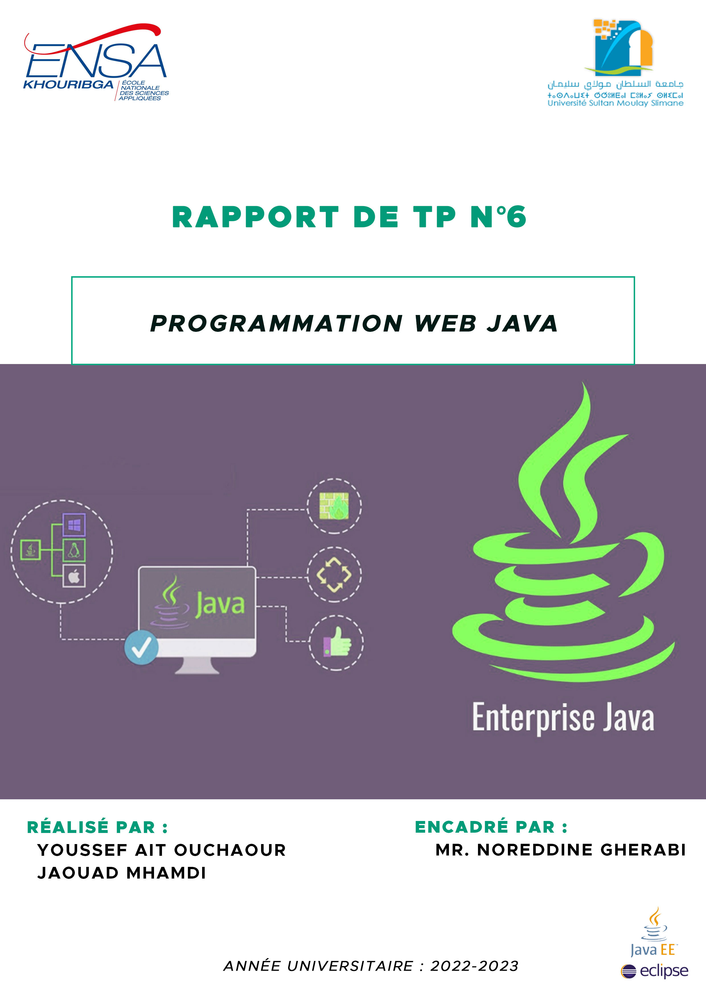

___

<h2 align="center" style="color:red">Sommaire </h2>
<span align="center">

#### ........................................... [Introduction](#cc1)  ...........................................

#### ........................................... [Solutions](#cc2)  .............................................
###### Partie I
###### Partie II
###### Partie III

#### ........................................... [Conclusion](#cc3) ............................................

</span>

___


<h2 align="center" style="color:red" id="cc1">I. Introduction</h2>

**Enterprise Java Beans(EJB) est une technologie de développement d'applications Java qui vise à faciliter la création d'applications d'entreprise en offrant un cadre de développement standardisé et des fonctionnalités prêtes à l'emploi; est utilisé pour la création de composants logiciels réutilisables qui peuvent être déployés dans un conteneur d'EJB sur un serveur.**

___ 

<h2 align="center" style="color:red" id="cc2">II. Solution de TP</h2>
 

<h4 style="color:green"><u>I-Installation JBoss:</u></h4>

<h5 style="color:teal"> a :</h5>

*  On ajoute le nouveau serveur WildFly :
  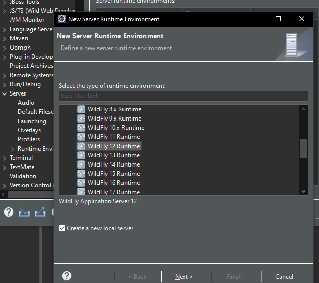
  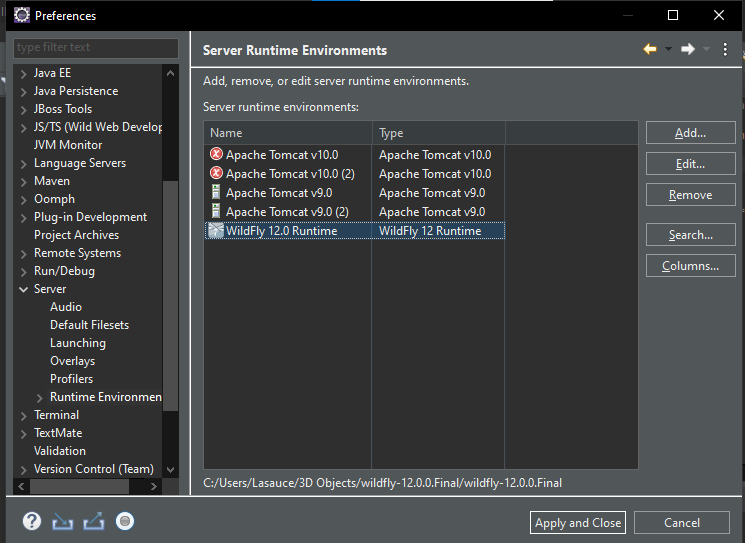

<h5 style="color:teal"> b :</h5>

* On démarre notre serveur WildFly:
  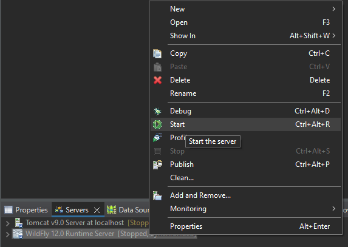


<h5 style="color:teal"> c :</h5>

*  Le serveur et bien installer.
  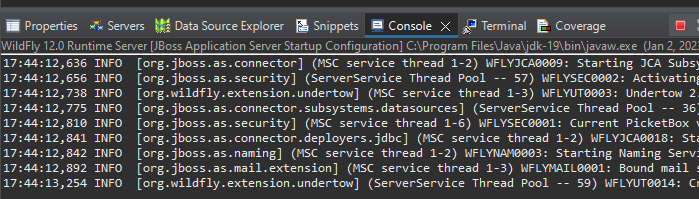

<h5 style="color:teal"> d :</h5>

*  On ajoute un nouveau utilisateur **ENSAK** par **add-user.bat**.
  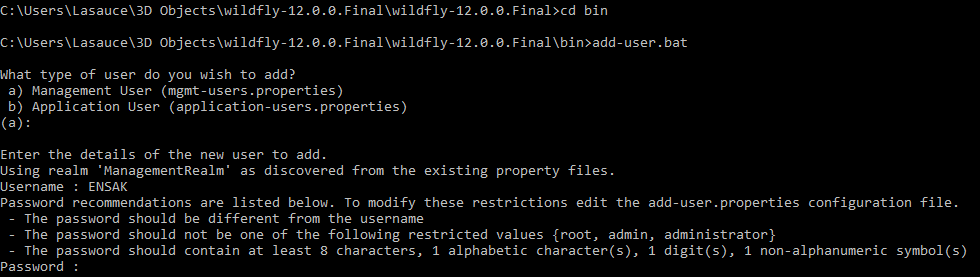
  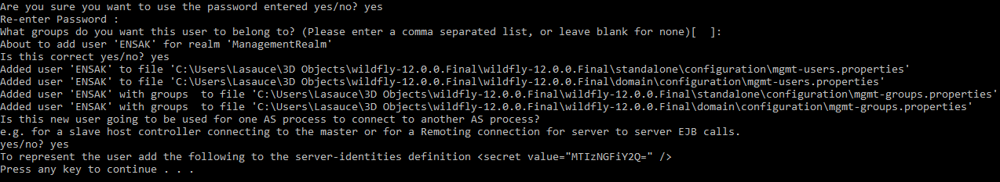

<h5 style="color:teal"> e :</h5>

*  On accéde a la platform de WildFly.
  
  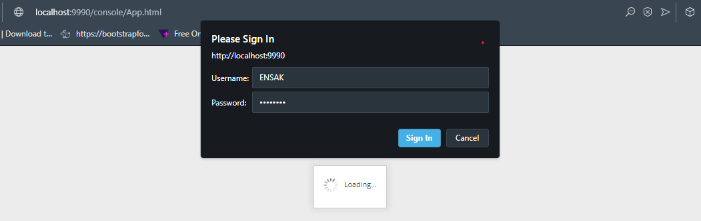
  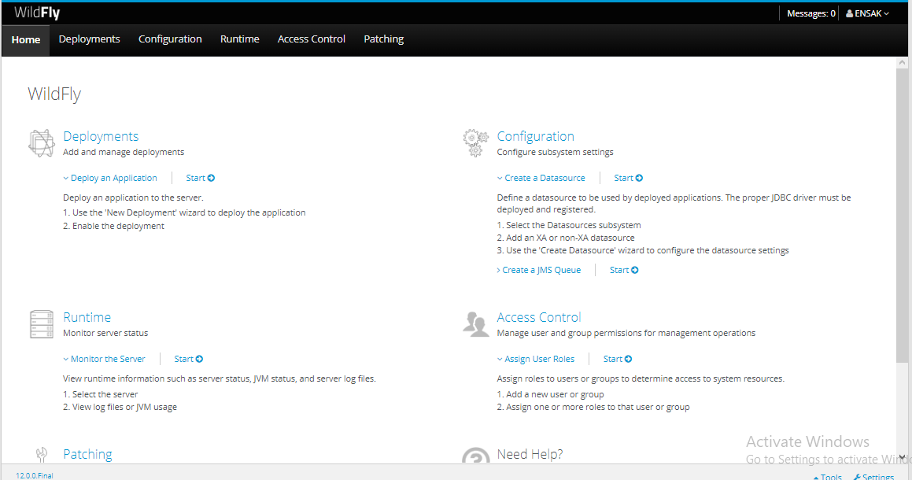

<h4 style="color:green"><u>I-Création d'une nouvelle source de données: </u></h4>

<h5 style="color:teal"> a :</h5>

*  On ajoute le répertoire **mysql** dans module/com :
  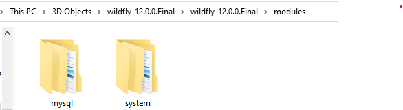

<h5 style="color:teal"> b :</h5>

* On edite le fichier **standalone.xml** et ajoute le driver mysql:

```xml
  <driver name="mysql" module="com.mysql"/>
```
  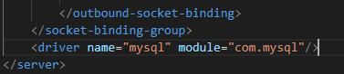


<h5 style="color:teal"> c :</h5>

*  Xamp est bien installer.
  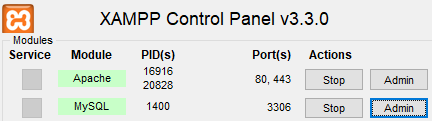

<h5 style="color:teal"> d :</h5>

*  On créont la base de données **db_commande**.
  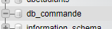

<h5 style="color:teal"> e :</h5>

*  On créont une nouvelle source de données **Datasources**.
  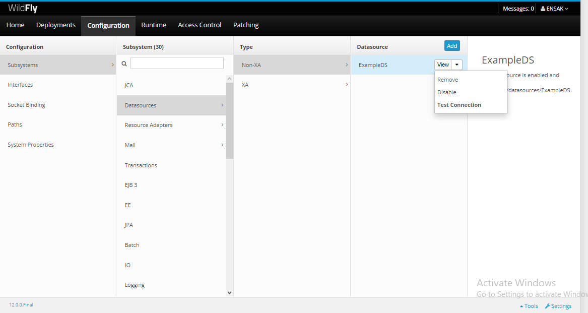
  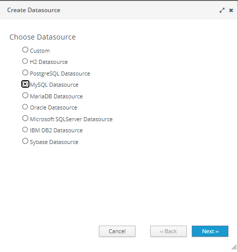
  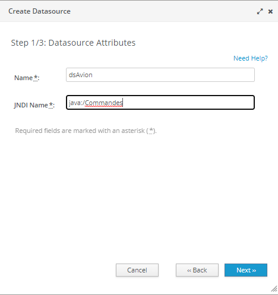
  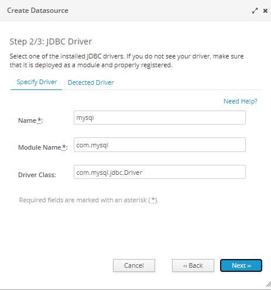
  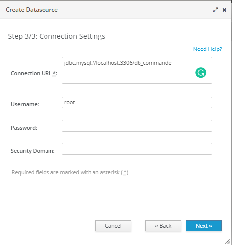

<h5 style="color:teal"> f :</h5>

*  On active le datasource et teste la conexion.
    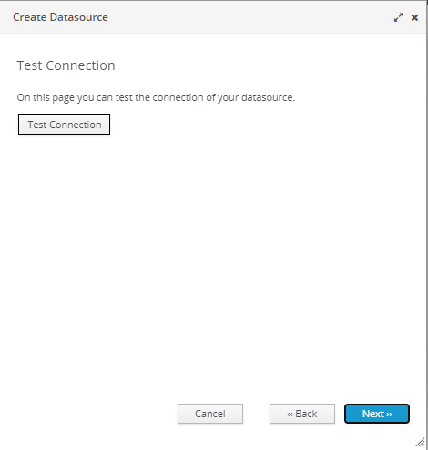
    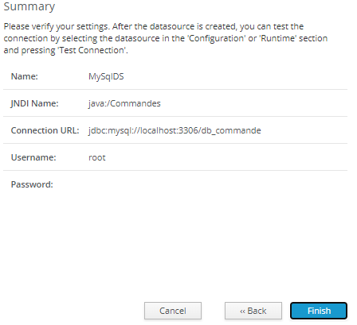

<h4 style="color:green"><u>I-Création de la couche métier: </u></h4>

<h5 style="color:teal"> a :</h5>

*  un nouveau projet EJB **ProjetCommandes**:
    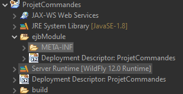

<h5 style="color:teal"> b :</h5>

* Créont un fichier JPA:
  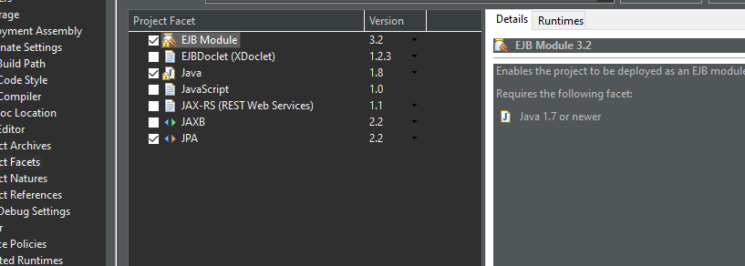

>**persistence.xml**

```xml
<?xml version="1.0" encoding="UTF-8"?>
<persistence version="2.2" xmlns="http://xmlns.jcp.org/xml/ns/persistence" 
xmlns:xsi="http://www.w3.org/2001/XMLSchema-instance" 
xsi:schemaLocation="http://xmlns.jcp.org/xml/ns/persistence 
http://xmlns.jcp.org/xml/ns/persistence/persistence_2_2.xsd">
<persistence-unit name="ProjetCommandes" transaction-type="JTA">
	<jta-data-source>java:/Commandes</jta-data-source>
	<properties>
		<property name="hibernate.dialect" value="og.hibernate.dialect.MYSQLDialect"/>
		<property name="hibernate.hbm2ddl.auto" value="update"/>
	</properties>
</persistence-unit>
</persistence>
```
<h5 style="color:teal"> c, d et e:</h5>
   
* Créont les entités de modéle , dans le package com.entities.
  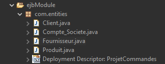

>**Client.java**

```java
package com.entities;

import java.io.Serializable;
import java.lang.Integer;
import java.lang.String;
import java.util.ArrayList;
import java.util.List;

import javax.persistence.*;

@Entity
@Table(name ="client")
public class Client implements Serializable {

	@Id
	@GeneratedValue(strategy = GenerationType.IDENTITY)
	private Integer code;
	private String nom;
	private String prenom;
	private String ville;
	private static final long serialVersionUID = 1L;
@ManyToMany(mappedBy ="cl")
private List<Produit> pr=new ArrayList<Produit>();
  
public Client() {
  super();
} 
public Client(Integer code, String nom, String prenom, String ville) {
	super();
	this.code = code;
	this.nom = nom;
	this.prenom = prenom;
	this.ville = ville;
}

@OneToOne
@JoinColumn(name ="Num" ,referencedColumnName = "Numero")
private Compte_societe f1;

  public Integer getCode() {
    return this.code;
  }

  public void setCode(Integer code) {
    this.code = code;
  }   
  public String getNom() {
    return this.nom;
  }

  public void setNom(String nom) {
    this.nom = nom;
  }   
  public String getPrenom() {
    return this.prenom;
  }

  public void setPrenom(String prenom) {
    this.prenom = prenom;
  }   
  public String getVille() {
    return this.ville;
  }
    public void setVille(String ville) {
    this.ville = ville;
  }  
}
```
> **Produit.java**

```java
package com.entities;

import java.io.Serializable;
import java.lang.Float;
import java.lang.Integer;
import java.lang.String;
import java.util.ArrayList;
import java.util.List;

import javax.persistence.*;

@Entity
public class Produit implements Serializable {

@Id
@GeneratedValue(strategy = GenerationType.IDENTITY)
private Integer Numero;
private Float prix;
private String Marque;
private static final long serialVersionUID = 1L;
@OneToMany(mappedBy = "p")
private List<Fournisseur> l=new ArrayList<Fournisseur>();

@ManyToMany
@JoinTable(name ="commander")
private List<Client> cl=new ArrayList<Client>();

  public Produit() {
    super();
  }   
  public Integer getNumero() {
    return this.Numero;
  }

  public void setNumero(Integer Numero) {
    this.Numero = Numero;
  }   
  public Float getPrix() {
    return this.prix;
  }

  public void setPrix(Float prix) {
    this.prix = prix;
  }   
  public String getMarque() {
    return this.Marque;
  }

  public void setMarque(String Marque) {
    this.Marque = Marque;
  }
}

```

>**Fournisseur.java**

```java
package com.entities;

import java.io.Serializable;
import java.lang.Integer;
import java.lang.String;
import javax.persistence.*;

@Entity

public class Fournisseur implements Serializable {
   
@Id
@GeneratedValue(strategy = GenerationType.IDENTITY)
private Integer Code;
private String Nom;
private String Adresse;
private static final long serialVersionUID = 1L;
@ManyToOne
@JoinColumn(name ="Numero")
private Produit p;

  public Fournisseur() {
    super();
  }   
  public Integer getCode() {
    return this.Code;
  }
    public void setCode(Integer Code) {
    this.Code = Code;
  }   
  public String getNom() {
    return this.Nom;
  }
  public void setNom(String Nom) {
    this.Nom = Nom;
  }   
  public String getAdresse() {
    return this.Adresse;
  }
  public void setAdresse(String Adresse) {
    this.Adresse = Adresse;
  }   
}
```
> **Compte_societe.java**

```java
package com.entities;

import java.io.Serializable;
import java.lang.Integer;
import java.lang.String;
import javax.persistence.*;

@Entity
public class Compte_societe implements Serializable {

	@Id
	@GeneratedValue(strategy = GenerationType.IDENTITY)

	private Integer Numero;
	private String Type;
	private static final long serialVersionUID = 1L;
	
	@OneToOne(mappedBy ="f1")	
private Client c1;
	public Compte_societe() {
		super();
	}   
	public Integer getNumero() {
		return this.Numero;
	}
    public void setNumero(Integer Numero) {
		this.Numero = Numero;
	}   
	public String getType() {
		return this.Type;
	}
    public void setType(String Type) {
		this.Type = Type;
	}  
}
```
___ 

<h2 align="center" style="color:red" id="cc3">III. Conclusion</h2>

**Dans ce 6eme TP nous nous entraînons à travailler avec les EJBs et leurs anotations; on réalisont d'un projet qui contients 4 entities et qui est liées avec une base de données.**